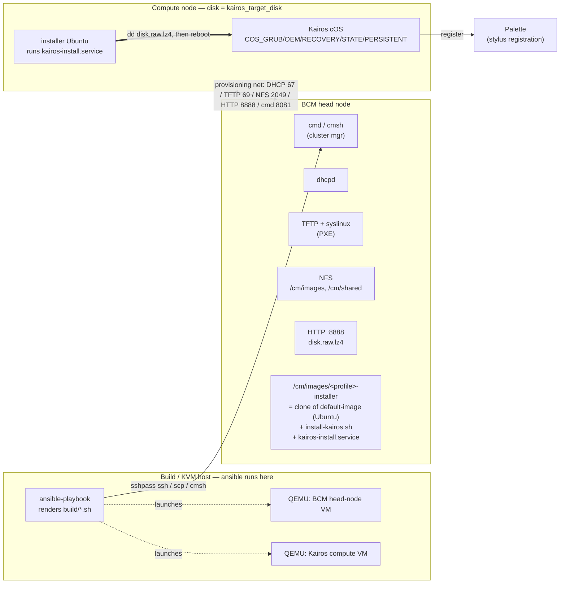
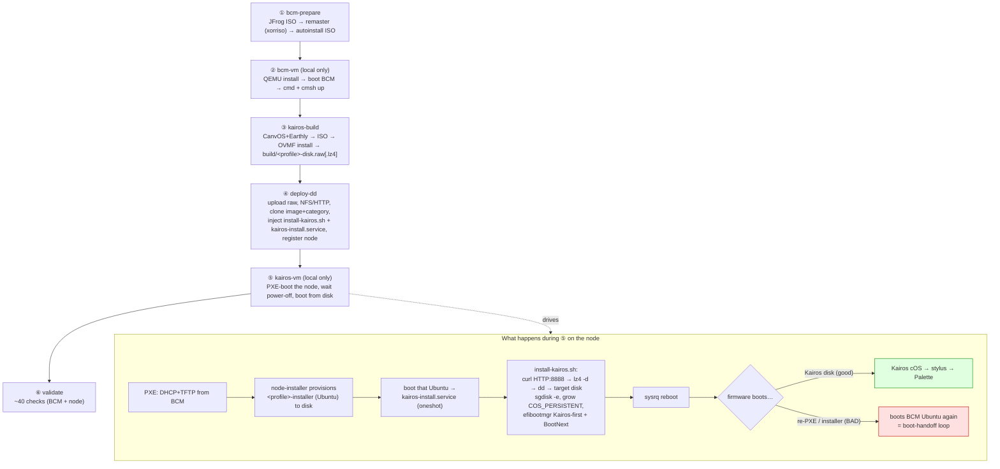
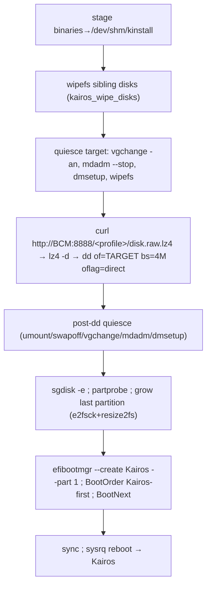
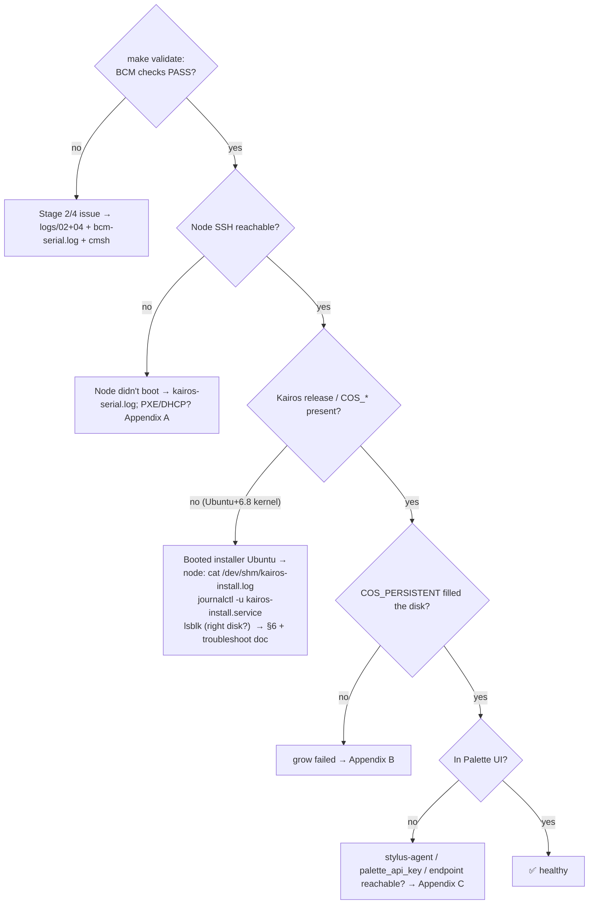

# BCM + Kairos pipeline — architecture & troubleshooting runbook

A map of every moving piece, the end-to-end workflow, and — per stage — **where it logs, how to confirm it worked, and what to do when it didn't.** Use the "[Where did it break?](#where-did-it-break)" flow to jump to the right stage.

> Companion docs: `README.md` (variables/targets), `docs/pipeline-deep-dive.md` (engineer walkthrough), `docs/troubleshoot-node-booted-bcm-image.md` (the #1 failure), `inventory/group_vars/all.example.yml` (full var reference).

---

## 0. Fast triage — first commands when a deploy fails

Run these in order; each says what it tells you and where to go next.

```bash
# 1. Most recent stage log — what failed and why
tail -n 60 "$(ls -t logs/0*-*.log | head -1)"

# 2. The EXACT commands that ran after templating (the source of truth)
less build/deploy-dd.sh        # or build/install-kairos.sh, build/validate.sh, build/bcm-*.sh

# 3. Full BCM + node health (PASS / WARN / FAIL)
make validate ANSIBLE_ARGS="-e kairos_profile=<profile> -e kairos_node_name=<node>"

# 4. Node came up as Ubuntu, not Kairos?  → on the node (ssh via BCM):
cat /dev/shm/kairos-install.log                          # where the dd/grow/efibootmgr failed
journalctl -u kairos-install.service -b --no-pager | tail -40
lsblk -o NAME,SIZE,FSTYPE,LABEL                          # COS_* present? right disk?

# 5. Live consoles (local-KVM)
make bcm-serial        # BCM VM console
make kairos-serial     # compute-node console
```

Then jump to the failing stage in [§5](#5-per-stage-reference) or follow [§7 "Where did it break?"](#where-did-it-break).

---

## 1. What this is, and the two modes

An Ansible pipeline that builds a Spectro Cloud **Kairos** image and provisions it onto edge nodes through a Bright Cluster Manager (**BCM**) head node. Mode is selected purely by inventory:

| Mode | When | Stages run | Selector |
|---|---|---|---|
| **Local-KVM** | dev/demo on one host | **1–6** (`make all`) — stands up BCM + a Kairos node in QEMU | `bcm_ssh_host` = `localhost` (default) |
| **Remote-BCM** | real site | **3, 4, 6** — deploy to bare-metal under an existing BCM | `bcm_ssh_host` = real IP + a jumphost |

**The pattern that matters for debugging:** each role's `tasks/main.yml` is thin — it renders a `templates/*.sh.j2` into **`build/*.sh`** (substituting inventory vars) and then runs it. **`build/<stage>.sh` is the source of truth for what actually executed** after templating. When in doubt, read it.

```
make <target>  →  playbooks/0N-<stage>.yml  →  roles/<role>/  →  build/<stage>.sh  →  ssh/cmsh/dd on BCM or node
```

---

## 2. The pieces



**Networks (local-KVM):** BCM and the compute VM share a QEMU **socket network** — BCM `listen=:31337`, node `connect=:31337` — which is the *provisioning network* (`bcm_internal_cidr`, default `192.168.98.0/24`; your site may use another, e.g. `10.184.70.0/x`). BCM also has a user-mode NAT NIC with **host-forwards**: `bcm_ssh_port`→22, `bcm_https_port`→443. Kernel args force `net.ifnames=0` so NICs are `ethN`.

**Ports in play:** DHCP 67/udp, TFTP 69/udp, NFS 111+2049, **HTTP 8888 (Kairos raw image)**, rsync 873, cmd 8081 (node→BCM heartbeat), SSH 22.

---

## 3. End-to-end workflow



The hand-off at **P6** is where most "it didn't become Kairos" problems live (§Appendix A).

---

## 4. Logging — where everything lands

| What | Where | Notes |
|---|---|---|
| Per-stage Ansible run | `logs/0N-<stage>.log` | Makefile `tee`s each `ansible-playbook` here |
| **The rendered script that actually ran** | `build/<stage>.sh` (e.g. `build/deploy-dd.sh`, `build/install-kairos.sh`, `build/validate.sh`) | post-templating; **read this to see the concrete commands** |
| BCM VM console (local) | `logs/bcm-install-serial.log` (stage-2 install), `logs/bcm-serial.log` (boot) | `make bcm-serial` tails it |
| Compute node console (local) | `logs/<slug>-serial.log` (`node001`→`kairos-serial.log`) | `make kairos-serial` tails it; **truncated between PXE-install and disk-boot phases** |
| Non-blocking finisher | `logs/<slug>-finish.log` | only when `kairos_vm_wait=false` |
| **install-kairos.sh on the node** | `/dev/shm/kairos-install.log` | the dd/grow/efibootmgr trace — **the key file when the node didn't become Kairos** |
| install service journal | node: `journalctl -u kairos-install.service -b` | oneshot unit output |
| stylus / Palette | node: `journalctl -u stylus-agent` | registration |
| BCM node-installer | BCM: `/var/log/node-installer` (also copied to the provisioned root) | what BCM did to the disks |
| More verbosity | `ANSIBLE_ARGS="-vvv" make <stage>` | task-level detail |

---

## 5. Per-stage reference

Each stage below: **does → artifacts → logs → validate → common failures.**

### Stage 1 — `bcm-prepare` (`01-bcm-prepare.yml` → `bcm_prepare`)
**Does:** downloads the BCM ISO from JFrog, extracts + patches the rootfs (bakes hostname/timezone, an unattended-autoinstall service), and remasters an unattended ISO with `xorriso`. Also makes a small FAT "config drive" carrying the root password.
**Artifacts:** `build/bcm-autoinstall.iso`, `build/.bcm-kernel`, `build/.bcm-rootfs-auto.cgz`, `build/.bcm-init.img`.
**Logs:** `logs/01-bcm-prepare.log`.
**Validate:** `ls -l build/bcm-autoinstall.iso` (exists, ~GB-sized).
**Common failures:**

| Symptom | Cause | Fix |
|---|---|---|
| `curl` 401/403 on download | bad/expired `jfrog_token`, wrong `jfrog_instance`/`jfrog_repo`/`iso_filename` | fix the JFrog vars; confirm the artifact path in a browser |
| `xorriso: command not found` | missing build dep | `make install-deps` (xorriso, 7z) |
| ISO already present, stale | `dist/<iso>` cached from old run | delete the cached ISO to force re-download |

### Stage 2 — `bcm-vm` (`02-bcm-vm.yml` → `bcm_vm`) — *local-KVM only*
**Does:** QEMU boots the autoinstall ISO (Phase 1, up to ~90 min), then boots BCM from the installed disk (Phase 2). Networking = socket net `listen=:31337` + NAT with `hostfwd :bcm_ssh_port→22 / :bcm_https_port→443`. Waits for SSH → `cmfirstboot` done → `cmd` active → `cmsh` answers.
**Artifacts:** `build/bcm-headnode.qcow2` (running BCM VM), pidfile `build/.bcm-qemu.pid`.
**Logs:** `logs/bcm-install-serial.log`, `logs/bcm-serial.log` (`make bcm-serial`).
**Validate:**
```bash
sshpass -p <bcm_password> ssh -p <bcm_ssh_port> root@localhost "cmsh -c 'main; status'"   # expect a status, not a hang
```
**Common failures:**

| Symptom | Cause | Fix |
|---|---|---|
| `WARN: port … still in use` | a previous BCM VM still running / port taken | `make stop`/`make teardown`; pick a free `bcm_ssh_port` |
| Phase-1 never powers off (90-min timeout) | autoinstall stalled | read `logs/bcm-install-serial.log`; usually a build-config or network issue in the ISO |
| SSH never comes up | KVM/OVMF missing, or VM didn't boot | check `/dev/kvm` exists, `make setup`; tail `logs/bcm-serial.log` |
| `cmsh` hangs | `cmd` not active yet | wait; the role polls `cmfirstboot`/`cmd` for up to ~15 min |

### Stage 3 — `kairos-build` (`03-kairos-build.yml` → `kairos_build`)
**Does:** clones CanvOS, renders `CanvOS/.arg` (from `kairos_canvos_defaults` + your `kairos_canvos_args`), applies overlay + Earthfile patches, runs `./earthly.sh +iso`. Then (day-1, `kairos_build_raw_disk=true`) boots the ISO in **OVMF/QEMU**, runs `kairos-agent install` driven over a serial socket using the baked **`cloud-config.yaml.j2`**, verifies the disk is bootable (ESP loader + `cOS/active.img` > 1 GiB), patches ext4 features for GRUB and `net.ifnames=0`, then trims + checksums.
**`cloud-config.yaml.j2` bakes the boot-time integration:** stylus/Palette config (endpoint, token, project, CA), the **BCM integration boot stage** (wait for net/ping BCM → look up node name by MAC via `cmsh` → set hostname → optional Palette label PUT → fetch BCM root key → **set node `installmode NOSYNC`** → chroot the BCM `cmd` daemon), and the install stage (`auto: true, poweroff: true`).
**Artifacts:** `build/<profile>-disk.raw` (+ `.sha256`), `build/<iso_name>.iso`, `build/cloud-config.yaml`. `make kairos-image` instead pushes provider images (day-2) and skips the raw disk.
**Logs:** `logs/03-kairos-build.log`; the in-build OVMF install serial is captured to a socket/log under `build/`.
**Validate:**
```bash
ls -l build/<profile>-disk.raw     # tens of GB; .sha256 present
```
**Common failures:**

| Symptom | Cause | Fix |
|---|---|---|
| Earthly/docker build fails | docker not running, network, CanvOS upstream change | `make setup`; check docker; retry; pin CanvOS if needed |
| OVMF install hangs / no shell prompt in serial | OVMF firmware missing, slow disk | ensure `/usr/share/OVMF/OVMF_CODE_4M.fd`; check the build serial log |
| "active.img not >1GiB" / "no ESP loader" assert | install didn't complete inside QEMU | re-run; inspect the OVMF serial; check `cloud-config.yaml` validity |
| Custom `OS_VERSION` (e.g. 26.04) fails | no published curated base | set `BASE_IMAGE` in `kairos_canvos_args` and build a base first |
| Stale CanvOS / build artifacts | leftovers from prior run | `make clean-canvos` (and `clean`) then rebuild |

### Stage 4 — `deploy-dd` (`04-deploy-dd.yml` → `deploy_dd`) — *always re-runs*
**Does (on BCM, via `build/deploy-dd.sh`):** configures DNS/NAT, **NFS exports** (`/cm/images/default-image`, `/cm/shared`, `/cm/images/<profile>-installer`), DHCP pool, rsync module; **lz4-compresses + uploads** the raw to `/cm/shared/kairos/<profile>/disk.raw.lz4`; starts the **HTTP :8888** server; **clones** `default-image`→`<profile>-installer` and `<source_category>`→`<profile>`; **injects `install-kairos.sh` + enables `kairos-install.service`** in the installer image; sets `installmode FULL`, kernel params, health-check exclude filters; **`createramdisk`**; **registers the node** (`device add physicalnode …` for local, or sets category/image/MAC on `bcm_target_node` for remote).
**Artifacts (on BCM):** the `<profile>-installer` software image, the `<profile>` category, `/cm/shared/kairos/<profile>/disk.raw.lz4`, `kairos-install.service` enabled in the image.
**Logs:** `logs/04-deploy-dd.log`; **`build/deploy-dd.sh`** = exact commands; BCM-side `cmsh` echoes in the log.
**Validate (on BCM):**
```bash
cmsh -c "softwareimage; use <profile>-installer; show" | grep -i kernelversion
cmsh -c "category; use <profile>; get softwareimage"            # = <profile>-installer
ls -l /cm/shared/kairos/<profile>/disk.raw.lz4                   # current build
curl -fsI http://localhost:8888/<profile>/disk.raw.lz4          # 200
ls -l /cm/images/<profile>-installer/etc/systemd/system/multi-user.target.wants/kairos-install.service  # symlink = enabled
```
**Common failures:**

| Symptom | Cause | Fix |
|---|---|---|
| SSH/sshpass to BCM fails | wrong `bcm_password`/`bcm_ssh_port`/host, jumphost | verify the `make validate` connectivity line; check `build/.bcm-ssh-config` |
| image clone fails / NFS not ready | BCM still settling, disk full | re-run; the script polls for the NFS mount |
| `kairos-install.service` symlink missing | enable step didn't run (stale image) | re-run `deploy-dd` (re-injects + enables + `createramdisk`) |
| HTTP 8888 curl fails | http service didn't start | check the `kairos-http.service` on BCM |

### Stage 5 — `kairos-vm` (`05-kairos-vm.yml` → `kairos_vm`) — *local-KVM only*
**Does:** Phase 1 launches the compute VM PXE-first (`-boot order=cn`) on the socket net → BCM provisions the installer Ubuntu → `kairos-install.service` runs `install-kairos.sh` → node powers off. Phase 2 boots the same disk (`-boot c`) using the **shared OVMF vars** (so the efibootmgr Kairos entry persists) and waits for Kairos. `kairos_vm_wait=false` hands the wait+disk-boot to a detached finisher.
**Artifacts:** `build/<slug>-compute.qcow2`, `build/ovmf-vars-<slug>-vm.fd`, pidfile.
**Logs:** `logs/<slug>-serial.log` (`make kairos-serial`) — **note it's truncated at the phase boundary**, so the install-phase trace is best read from the node's `/dev/shm/kairos-install.log`; `logs/<slug>-finish.log` in non-blocking mode.
**Validate:** node powers off after the install phase, then boots; `ssh kairos@<node-ip>` shows `/etc/kairos-release`.
**Common failures:**

| Symptom | Cause | Fix |
|---|---|---|
| No DHCP / PXE never starts | MAC/network mismatch, node not registered on the right `provisioninginterface` | check `kairos_vm_mac` matches the cmsh device; re-run deploy-dd |
| PXE pulls `syslinux.efi` then stalls | TFTP/next-stage over socket net (rig artifact), or BCM served `localboot` | for a *fresh install* it usually proceeds; for a re-PXE see Appendix A |
| Node boots **Ubuntu, not Kairos** | `kairos-install.service` didn't complete the `dd` | **see `docs/troubleshoot-node-booted-bcm-image.md`** + Appendix A |
| Disk-boot times out once then works | stylus first-boot registration stall | the role resets + reboots; second boot uses the default Kairos GRUB entry |

### Stage 6 — `validate` (`06-validate.yml` → `validate`)
**Does:** ~40 checks over SSH — BCM services/cluster and the booted node's OS/network/services/boot/disk/cloud-config — printing `PASS/WARN/FAIL` and a tally (exits non-zero on any FAIL).
**Logs:** `logs/06-validate.log`; `build/validate.sh`.
**Run:** `make validate ANSIBLE_ARGS="-e kairos_profile=<p> -e kairos_node_name=<node>"`.
**Reading the result — "booted BCM image, not Kairos"** is this signature:
```
[FAIL] Kairos release   [FAIL] kairos-agent   [FAIL] OEM config
[WARN] COS_OEM/RECOVERY/STATE/PERSISTENT — not found
[WARN] Root immutable   [WARN] Kairos boot chain   [WARN] net.ifnames=0
OS = Ubuntu …  Kernel = 6.8.0-51-generic   (a BCM default-image kernel)
```
`[WARN] Palette registration — no API key set` is **expected** when `palette_api_key` is empty (the minimal local-KVM config) — it's not a Kairos failure.

---

## 6. The on-node install (the crux): `install-kairos.sh`

Triggered by **`kairos-install.service`** (`Type=oneshot`, `ExecStartPre=sleep 10`, `ExecStart=/usr/local/sbin/install-kairos.sh`, `TimeoutStartSec=1800`, enabled via `multi-user.target.wants` symlink — injected by `deploy-dd.sh.j2`).



Reads `kairos_target_disk` (e.g. `/dev/vda` local, `/dev/nvme0n1` remote). **Every step logs to `/dev/shm/kairos-install.log`** — that file tells you exactly which step failed.

---

## 7. Where did it break? {#where-did-it-break}



---

## Appendix A — boot-handoff loop (boots BCM Ubuntu instead of Kairos)

**Mechanism:** BCM provisions the `<profile>-installer` (a clone of `default-image` = Ubuntu) to the disk; the node boots it; `kairos-install.service` `dd`s Kairos and reboots. If the node then **PXEs again** (BCM-managed nodes are network-boot-first) before booting the Kairos it just wrote, the node-installer re-provisions Ubuntu over it — a loop.

**Confirm:** node is Ubuntu + BCM kernel, no `COS_*`; `/dev/shm/kairos-install.log` shows the dd never completed *or* completed but the next boot re-PXE'd.

**Fix levers:**
- `install-kairos.sh` sets the Kairos efibootmgr entry **first** in `BootOrder` **and** sets `BootNext` (one-shot) — but a BMC/firmware forced to PXE will bypass UEFI order.
- The durable fix is BCM/node-side: after a successful install, the node must **boot the local disk**, not network-first (set the node `NOSYNC` so BCM stops re-provisioning — the baked cloud-config does this *once Kairos boots*; chicken-and-egg if Kairos never boots, so the first Kairos boot must be forced via firmware/BMC disk-boot or `BootNext`).
- Verify on the real node: serial at power-on (`Start PXE` vs `Boot#### Kairos`), `efibootmgr -v`, `ipmitool chassis bootparam get 5`.

## Appendix B — COS_PERSISTENT didn't grow

`install-kairos.sh` deletes+recreates the last partition to fill the disk, then `e2fsck`+`resize2fs`. If the device node for the new partition isn't created (udev) the resize fails (`resize2fs: No such device … p5`) and persistent stays at build size → fills up → node crashes minutes after boot. Check `/dev/shm/kairos-install.log` around "Growing last partition"; ensure no `udevadm --stop-exec-queue` lingers (that bug was removed). `lsblk` should show `COS_PERSISTENT` ≈ disk size.

## Appendix C — Palette registration

Node didn't appear in Palette: (1) it's not actually Kairos (Appendix A) → no `stylus-agent`; (2) `palette_api_key`/`palette_project_uid`/`palette_endpoint` empty or wrong (the minimal local-KVM config leaves them blank on purpose — registration is skipped); (3) endpoint unreachable from the node (on-prem Palette not routable from the rig); (4) self-signed endpoint without `palette_ca_cert`. Check `journalctl -u stylus-agent` and the cloud-config's stylus block.
