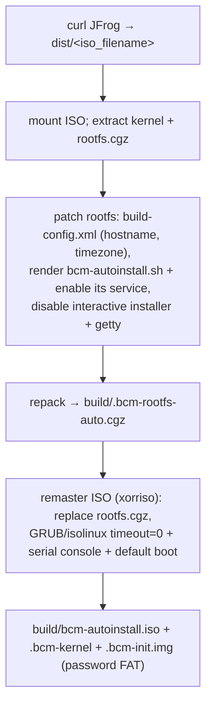

# Stage 1 — `bcm-prepare`

Downloads the BCM head-node ISO and **remasters it into an unattended-install ISO** (bakes hostname/timezone + an autoinstall service, hides the boot menu, adds a serial console). Output feeds stage 2 (local-KVM) — on a remote-BCM deploy you already have a head node, so this stage only matters for standing one up.

| | |
|---|---|
| **Playbook / role** | `playbooks/01-bcm-prepare.yml` → `roles/bcm_prepare` |
| **Target** | `make bcm-prepare` |
| **Modes** | local-KVM (and remote, if building a head-node ISO) |
| **Key files** | `templates/bcm-autoinstall.sh.j2`, `files/bcm-autoinstall.service`, `files/build-config.xml.tpl` |

## What it does



The autoinstall service runs `bcm-autoinstall.sh` on first boot to drive BCM's installer unattended; `build-config.xml` carries the hostname/timezone and base config.

## Inputs

| Var | Purpose |
|---|---|
| `jfrog_token` | **secret** — auth to download the ISO (the one must-set in a minimal local-KVM `all.yml`) |
| `jfrog_instance` / `jfrog_repo` / `iso_filename` | where/what to download |
| `bcm_hostname` / `bcm_timezone` | baked into `build-config.xml` |
| `bcm_password` | written to the config FAT drive (the BCM root password) |

## Artifacts
`build/bcm-autoinstall.iso`, `build/.bcm-kernel`, `build/.bcm-rootfs-auto.cgz`, `build/.bcm-init.img`. (Gitignored.)

## Logging
`logs/01-bcm-prepare.log`. `ANSIBLE_ARGS="-vvv"` for task detail.

## Validate it worked
```bash
ls -l build/bcm-autoinstall.iso build/.bcm-kernel build/.bcm-rootfs-auto.cgz   # all present, ISO ~GB
```

## Troubleshooting

| Symptom | Cause | Fix |
|---|---|---|
| `curl … 401/403` | bad/expired `jfrog_token`, wrong instance/repo/filename | fix the JFrog vars; confirm the artifact path resolves in a browser |
| ISO is stale | `dist/<iso>` cached from an old run | delete the cached ISO to force re-download |
| `xorriso`/`7z` not found | missing build deps | `make install-deps` |
| mount/chroot "permission denied" | not running with privilege | ensure `ansible.cfg` has `become: true` |
| BCM VM later won't boot the remastered ISO | GRUB/isolinux patch malformed | inspect the patched cfgs; test the ISO in QEMU |

## See also
[Runbook §5](architecture-and-troubleshooting.md#5-per-stage-reference) · [Stage 2 — bcm-vm](stage-2-bcm-vm.md) · [docs index](README.md).
