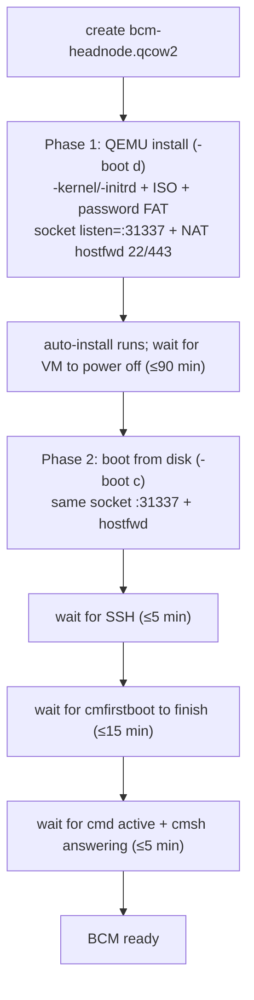

# Stage 2 — `bcm-vm`  *(local-KVM only)*

Boots the head node from the stage-1 ISO in QEMU, lets it auto-install, then boots it from disk and waits until BCM is fully operational (`cmd` + `cmsh`). After this, a local BCM is listening on the QEMU **socket network `:31337`** (the provisioning net) and on host-forwarded SSH/HTTPS — ready for stages 3–6.

| | |
|---|---|
| **Playbook / role** | `playbooks/02-bcm-vm.yml` → `roles/bcm_vm` |
| **Target** | `make bcm-vm` |
| **Mode** | local-KVM only (remote = a real, existing BCM) |
| **Runtime** | up to ~90 min (auto-install) |

## What it does — two QEMU phases



**Networking:** NIC 1 = QEMU **socket `listen=:31337`** (the provisioning network compute nodes connect to); NIC 2 = user-mode NAT with **host-forwards** `:bcm_ssh_port→22` and `:bcm_https_port→443`. So you reach BCM at `root@localhost -p <bcm_ssh_port>`.

## Inputs

| Var | Default (local-KVM) | Purpose |
|---|---|---|
| `bcm_vm_ram` / `bcm_vm_cpus` / `bcm_vm_disk_size` | 8192 / 4 / 100G | VM sizing |
| `bcm_ssh_port` / `bcm_https_port` | 10022 / 10443 | host-forwarded ports to BCM 22 / 443 |
| `bcm_password` | bcm-test-pw | BCM root password (set by stage 1, used to log in) |
| `bcm_internal_ip` | 192.168.98.2 | BCM's IP on the provisioning net |

## Artifacts
`build/bcm-headnode.qcow2` (the running BCM VM), `build/.bcm-qemu.pid`.

## Logging
`logs/bcm-install-serial.log` (Phase 1 install), `logs/bcm-serial.log` (Phase 2 boot) — tail with **`make bcm-serial`**. Ansible run: `logs/02-bcm-vm.log`.

## Validate it worked
```bash
sshpass -p <bcm_password> ssh -o StrictHostKeyChecking=no -p <bcm_ssh_port> root@localhost \
  "cmsh -c 'main; status'"     # returns cluster status, not a hang
```

## Troubleshooting

| Symptom | Cause | Fix |
|---|---|---|
| `WARN: port … in use` | a previous BCM VM / something on the port | `make stop` / `make teardown`; choose a free `bcm_ssh_port` |
| QEMU very slow / hangs | no KVM (`/dev/kvm`) or nested virt off | enable KVM/nested virt; `make setup` |
| QEMU "No such file" on firmware | OVMF missing | `apt install ovmf` |
| Phase-1 never powers off (90-min timeout) | auto-install stalled | read `logs/bcm-install-serial.log`; usually a build-config/network issue baked in stage 1 |
| SSH never comes up | install failed / VM crashed | tail `logs/bcm-serial.log` for a panic; re-run stage 2 |
| `cmfirstboot` >15 min / `cmd` inactive | BCM slow or first-boot stalled | check `/var/log/cmd*` on BCM; verify the stage-1 hostname/timezone patch |

## See also
[Runbook §5](architecture-and-troubleshooting.md#5-per-stage-reference) · [Stage 1 — bcm-prepare](stage-1-bcm-prepare.md) · [Stage 4 — deploy-dd](stage-4-deploy-dd.md) · [docs index](README.md).
