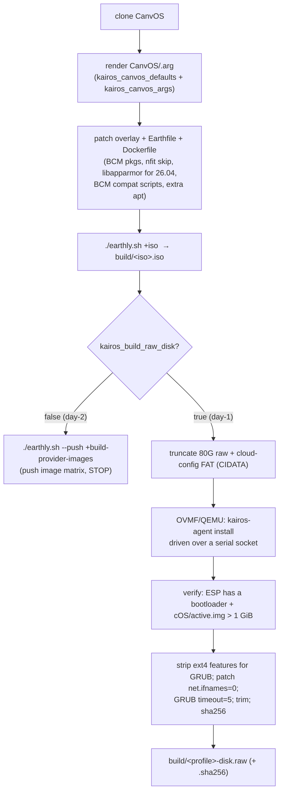

# Stage 3 — `kairos-build`

Builds the Kairos image: a CanvOS/Earthly ISO, then (day-1) a **bootable raw disk** (`build/<profile>-disk.raw`) by installing Kairos into it under OVMF/QEMU. The raw is what stage 4 uploads and stage 5 `dd`s onto a node.

| | |
|---|---|
| **Playbook / role** | `playbooks/03-kairos-build.yml` → `roles/kairos_build` |
| **Targets** | `make kairos-build` (day-1, ISO + raw) · `make kairos-image` (day-2, push provider images only) |
| **Modes** | local-KVM **and** remote-BCM |
| **Runtime** | ~30 min (CanvOS build + in-QEMU install) |
| **Key template** | `roles/kairos_build/templates/cloud-config.yaml.j2` (baked into the image) |

## What it does



**The in-QEMU install (day-1):** boots `build/<iso>.iso` headless under OVMF with the raw disk attached, drives `kairos-agent install` over a serial Unix socket, and injects `cloud-config.yaml` as `/oem/90_custom.yaml` (+ `99_bcm.yaml` / `99_userdata.yaml`). It retries with a teardown between attempts, then powers off. A post-install **verify** asserts the ESP holds a bootloader and `cOS/active.img` is a real rootfs (>1 GiB) — a failed install is caught here, not three stages later.

**What `cloud-config.yaml.j2` bakes in** (runs when the *node* boots Kairos, not now):
- `install: auto + poweroff`.
- **stylus/Palette** block — endpoint, token/projectUid, tags, CA cert.
- **boot stage → BCM integration:** wait for the NIC + ping BCM → look up the node name by MAC via `cmsh` → set hostname → (if a Palette API key is set) PUT labels → fetch the BCM root key → **`set installmode NOSYNC`** (so BCM stops re-provisioning) → NFS-mount `/cm/images/default-image` and `chroot`-exec the BCM `cmd` daemon.

## Inputs (most-used)

| Var | Purpose |
|---|---|
| `kairos_profile` | namespaces the artifact + all BCM-side state (default `default-kairos`) |
| `kairos_canvos_args` | dict merged over `kairos_canvos_defaults` → `CanvOS/.arg`: `OS_VERSION`, `K8S_DISTRIBUTION`, `UPDATE_KERNEL`, `CIS_HARDENING`, `BASE_IMAGE`, … |
| `kairos_extra_apt_packages` | extra apt packages baked into the image |
| `kairos_user_data` | raw cloud-config → `/oem/99_userdata.yaml` |
| `kairos_k8s_versions` | override `CanvOS/k8s_version.json` (multi-version build) |
| `kairos_build_raw_disk` | `true` = ISO + raw (day-1); `false` = push provider images (day-2). `make kairos-image` sets `false` |
| `palette_*` | baked into the image's stylus config |

Override per-run without editing inventory:
```bash
ANSIBLE_ARGS="-e kairos_profile=u2204 -e 'kairos_canvos_args={\"OS_VERSION\":\"22.04\"}'" make kairos-build
```

## Artifacts
`build/<profile>-disk.raw` (+ `.sha256`), `build/<iso_name>.iso`, `build/cloud-config.yaml`. (All gitignored.)

## Logging
`logs/03-kairos-build.log` (Ansible run). The in-QEMU install serial is captured under `build/` (the role tails it to detect the installer prompt). Use `ANSIBLE_ARGS="-vvv"` to see the Earthly output.

## Validate it worked
```bash
ls -l build/<profile>-disk.raw build/<profile>-disk.raw.sha256   # tens of GB, checksum present
```
The role's own verify step (ESP loader + `active.img > 1 GiB`) fails the play if the install was incomplete.

## Troubleshooting

| Symptom | Cause | Fix |
|---|---|---|
| Earthly/docker build fails | docker not running / network / CanvOS upstream change | `make setup`; check `docker ps`; retry; pin CanvOS |
| `FROM ttl.sh/kairos-ubuntu:<ver>…` 404 | `OS_VERSION` has no published curated base (e.g. 26.04) | build a base first (`make kairos-base BASE_OS_IMAGE=ubuntu:26.04`) and set `BASE_IMAGE` in `kairos_canvos_args` |
| Verify fails: "active.img only NKB" / "no ESP loader" | `kairos-agent install` didn't complete in QEMU | re-run; read the in-QEMU serial under `build/`; check `cloud-config.yaml` validity |
| OVMF install hangs at the installer prompt | OVMF firmware missing / very slow disk | ensure `/usr/share/OVMF/OVMF_CODE_4M.fd` (`apt install ovmf`) |
| `build/` owned by root afterward | tasks run `become: true` | the role chowns back at the end; if interrupted, `sudo chown -R $USER build/` |
| u26 node won't boot later | initrd missing `libapparmor.so.1` | the Earthfile patch bundles it for 26.04 — confirm it's present |

## See also
[Runbook §5](architecture-and-troubleshooting.md#5-per-stage-reference) · [Stage 4 — deploy-dd](stage-4-deploy-dd.md) · `roles/kairos_build/defaults/main.yml` (every `.arg` default).
