# Stage 4 — `deploy-dd`

Configures the BCM head node to PXE-install Kairos onto a target node via whole-disk `dd`. The BCM is registered as an Ansible managed host (`add_host`) and configured via native delegated tasks (one per `[N/7]` step). **Always re-runs** (idempotent), so it's the stage you re-run after almost any change.

> **Rearchitected to native Ansible (IN-2292).** This stage used to render one 417-line `deploy-dd.sh` and run it over SSH; it's now `roles/deploy_dd/tasks/*.yml` delegated to the BCM. The step-by-step flow below is still accurate conceptually; the implementation is idempotent tasks, not a bash script.

| | |
|---|---|
| **Playbook / role** | `playbooks/04-deploy-dd.yml` → `roles/deploy_dd` |
| **Target** | `make deploy-dd` |
| **Modes** | local-KVM **and** remote-BCM |
| **Key files** | `roles/deploy_dd/tasks/*.yml` (BCM-side, native Ansible) · `templates/install-kairos.sh.j2` (dd-installer, runs on the node) |

## What it does (on BCM, in order)

**Pre-flight:** verify BCM reachable → wait for `cmfirstboot` to finish → wait for `cmd` active + `cmsh` answering.
**Network:** set DNS forwarders (only if `bcm_manage_dns=true`) → enable IP-forward + NAT. **NFS exports:** `/cm/images/default-image`, `/cm/shared`, `/cm/images/<profile>-installer` → DHCP pool (make dhcpd authoritative + set range — **only if `bcm_manage_cluster_defaults=true`**) → rsync module.

Then the seven numbered steps:

| Step | Action |
|---|---|
| **[1/7]** | lz4-compress the raw and **SCP** it to `/cm/shared/kairos/<profile>/disk.raw.lz4` (skips if remote size matches) |
| **[2/7]** | start the **HTTP server on :8888** (`python3 -m http.server` in `/cm/shared/kairos`) and `curl`-test it |
| **[3/7]** | `cmsh: softwareimage; clone default-image <profile>-installer` (the installer image = an Ubuntu clone), wait for its NFS tree |
| **[4/7]** | copy `install-kairos.sh` → image `/usr/local/sbin/`, create + **enable `kairos-install.service`** (oneshot), clear the image's `fstab`, mask `systemd-gpt-auto-generator` |
| **[5/7]** | PXE template tweak (`IPAPPEND 3→2`) + ensure syslinux modules in `/tftpboot` |
| **[6/7]** | set the installer image's `kernelversion`; `cmsh: category; clone <source_category> <profile>`; set `softwareimage`, `installmode FULL`, kernel params (`net.ifnames=0`), strip inapplicable `fsmounts`, add `exclude-<profile>` health filters; **register the node** |
| **[7/7]** | `cmsh: softwareimage; use <profile>-installer; createramdisk -w` |

**Node registration (step 6):**
- **Local-KVM:** `device; add physicalnode <node> <ip> enp0s2; set category/softwareimage/installmode FULL; set mac <kairos_vm_mac>; set provisioninginterface enp0s2`.
- **Remote-BCM:** sets category/softwareimage/installmode (+ optional `mac`/`ip`) on the existing `bcm_target_node`.

### The on-node installer (`install-kairos.sh`)
Triggered by **`kairos-install.service`** (`Type=oneshot`, `ExecStartPre=sleep 10`, `ExecStart=/usr/local/sbin/install-kairos.sh`, enabled via `multi-user.target.wants`). When the node boots the installer Ubuntu, it runs:

```mermaid
flowchart LR
  A["stage binaries → /dev/shm/kinstall"] --> B["wipefs siblings<br/>(kairos_wipe_disks)"]
  B --> C["quiesce target<br/>vgchange/dmsetup/wipefs"]
  C --> D["curl http://BCM:8888/&lt;profile&gt;/disk.raw.lz4<br/>→ lz4 -d → dd → kairos_target_disk"]
  D --> E["post-dd quiesce<br/>umount/swapoff/mdadm/dmsetup"]
  E --> F["sgdisk -e ; grow last partition<br/>(e2fsck + resize2fs)"]
  F --> G["efibootmgr Kairos-first + BootNext"]
  G --> H["sysrq reboot → Kairos"]
```



Everything it does is logged to **`/dev/shm/kairos-install.log`** on the node.

## Inputs (most-used)

| Var | Purpose |
|---|---|
| `kairos_profile` | which built artifact + BCM state to deploy |
| `kairos_target_disk` | the disk `dd` overwrites (e.g. `/dev/vda` local, `/dev/nvme0n1` remote) — **explicit, never auto-guessed** |
| `kairos_wipe_disks` | sibling disks to `wipefs` (clears stale LVM/RAID) |
| `bcm_source_category` | category to clone for `<profile>` (default `default`) |
| `bcm_target_node` | **remote only** — existing cmsh device to re-image |
| `kairos_vm_mac` | local-KVM node MAC (registration) |
| `bcm_manage_dns` / `bcm_manage_cluster_defaults` | keep **false** on shared/customer BCMs |

## Artifacts (on BCM)
`<profile>-installer` software image, `<profile>` category, `/cm/shared/kairos/<profile>/disk.raw.lz4`, the enabled `kairos-install.service` in the image, HTTP server on :8888.

## Logging
`logs/04-deploy-dd.log` · **`build/deploy-dd.sh`** and **`build/install-kairos.sh`** = the exact rendered commands · on the node: `/dev/shm/kairos-install.log` + `journalctl -u kairos-install.service -b`.

## Validate it worked (on BCM)
```bash
cmsh -c "category; use <profile>; get softwareimage"            # = <profile>-installer
ls -l /cm/shared/kairos/<profile>/disk.raw.lz4                  # current build
curl -fsI http://localhost:8888/<profile>/disk.raw.lz4         # 200
ls -l /cm/images/<profile>-installer/etc/systemd/system/multi-user.target.wants/kairos-install.service  # enabled
```

## Troubleshooting

| Symptom | Cause | Fix |
|---|---|---|
| SSH/sshpass to BCM fails | wrong `bcm_password`/`bcm_ssh_port`/host, jumphost | check the validate connectivity line; inspect `build/.bcm-ssh-config` |
| `[3/7]` image clone times out | BCM settling / NFS not ready / disk full | re-run; the script polls for the NFS mount |
| `kairos-install.service` symlink missing | enable step didn't run (stale image) | re-run `deploy-dd` (re-injects + enables + `createramdisk`) |
| `curl :8888` fails | `kairos-http.service` didn't start | check that unit on BCM; free port 8888 |
| node registration errors | duplicate/typo device name | `cmsh -c 'device; list'`; remove the stale device; re-run |
| later: node boots Ubuntu, not Kairos | `kairos-install.service` didn't complete the `dd` | [troubleshoot-node-booted-bcm-image](troubleshoot-node-booted-bcm-image.md) + read `/dev/shm/kairos-install.log` |

## See also
[Runbook §6 (on-node install)](architecture-and-troubleshooting.md#6-the-on-node-install-the-crux-install-kairossh) · [Stage 3 — kairos-build](stage-3-kairos-build.md) · [Stage 5 — kairos-vm](stage-5-kairos-vm.md).
