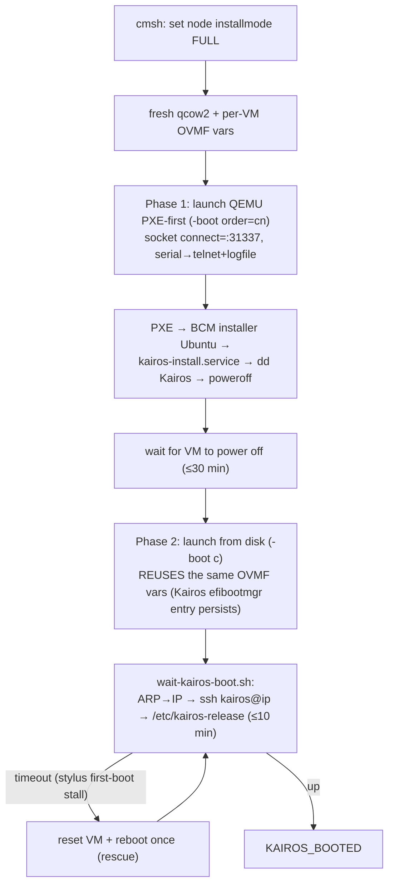

# Stage 5 — `kairos-vm`  *(local-KVM only)*

Boots a Kairos compute node in QEMU so the whole pipeline can be exercised on one host: it PXE-installs the node off the local BCM (stage 4 did the BCM-side setup), waits for the install to power the VM off, then boots it from disk and waits for Kairos to come up.

| | |
|---|---|
| **Playbook / role** | `playbooks/05-kairos-vm.yml` → `roles/kairos_vm` |
| **Target** | `make kairos-vm` |
| **Mode** | local-KVM only (remote nodes are real hardware) |
| **Networking** | QEMU socket `connect=:31337` → the BCM VM's provisioning network |

## What it does — two QEMU phases



**Phase 1 (PXE-install):** resets the node to `installmode FULL` via `cmsh`, makes a fresh `build/<slug>-compute.qcow2` and a **per-VM OVMF vars file**, then launches QEMU with `-boot order=cn` on the socket network. The node PXE-boots the BCM installer image, `kairos-install.service` runs `install-kairos.sh` (the `dd`), and the VM powers off. The role polls the PID for up to 30 min.

**Phase 2 (disk boot):** launches the same disk with `-boot c`, **reusing the OVMF vars from Phase 1** so the `Kairos` efibootmgr entry written during the install is honored. `wait-kairos-boot.sh` finds the node's IP via the BCM ARP table, SSHes in, and checks for `/etc/kairos-release` (≤10 min). If the first boot parks on the stylus first-boot/registration GRUB entry, the role **resets and reboots once** — the second boot uses the default active-Kairos entry.

**Non-blocking mode (`kairos_vm_wait=false`):** the play renders `build/kairos-finish-<slug>.sh`, launches it detached (`setsid nohup`), and returns immediately — so a second node can be brought up concurrently. Track via `logs/<slug>-finish.log`.

## Inputs

| Var | Default | Purpose |
|---|---|---|
| `kairos_vm_mac` | `52:54:00:00:02:01` | NIC MAC — **must match what `deploy-dd` registered** |
| `kairos_vm_ram` / `kairos_vm_cpus` / `kairos_vm_disk_size` | 4096 / 2 / 80G | VM sizing |
| `kairos_node_name` | `node001` | BCM device name; everything else (IP, serial port, artifact paths) derives from the node number |
| `kairos_vm_wait` | `true` | `false` = detached finisher (concurrent nodes) |

**Second concurrent node (A/B):** override `kairos_node_name` + `kairos_vm_mac` on the second `deploy-dd` + `kairos-vm` run; `node002` → `.11` / serial port 4322 / `node002-compute.qcow2` automatically (no collision with `node001`).

## Artifacts
`build/<slug>-compute.qcow2`, `build/ovmf-vars-<slug>-vm.fd`, `build/.<slug>-qemu.pid`. (`node001`'s slug is `kairos`.)

## Logging
`logs/05-kairos-vm.log` · **`logs/<slug>-serial.log`** (`make kairos-serial`) — **note it's truncated at the Phase-1→Phase-2 boundary**, so the install-phase trace is best read from the node's `/dev/shm/kairos-install.log` · `logs/<slug>-finish.log` (non-blocking) · live console: `telnet localhost <serial-port>` (4321 for node001).

## Validate it worked
The play itself blocks until `KAIROS_BOOTED` (blocking mode). Manually:
```bash
# node IP from BCM ARP, then:
ssh kairos@<node-ip> "cat /etc/kairos-release && lsblk -o NAME,LABEL | grep COS_"
```
Then `make validate ANSIBLE_ARGS="-e kairos_profile=<p> -e kairos_node_name=<node>"`.

## Troubleshooting

| Symptom | Cause | Fix |
|---|---|---|
| PXE never gets DHCP / hangs | `kairos_vm_mac` ≠ the registered device MAC, or node on wrong `provisioninginterface` | align `kairos_vm_mac`; re-run `deploy-dd`; check BCM `dhcpd` |
| PXE pulls `syslinux.efi` then stalls | next-stage TFTP over the socket net (rig artifact) / BCM served localboot | for a *fresh* install it usually proceeds; for a re-PXE see the boot-handoff note |
| node boots **Ubuntu, not Kairos** | `kairos-install.service` didn't complete the `dd` | [troubleshoot-node-booted-bcm-image](troubleshoot-node-booted-bcm-image.md); read `/dev/shm/kairos-install.log` |
| Phase-1 never powers off (30-min timeout) | `dd` stalled / image corrupt / HTTP:8888 down | read the serial log; verify the raw `sha256` + the BCM HTTP server |
| disk-boot times out once, then works | stylus first-boot registration stall | expected — the role's rescue resets + reboots; second boot is the active Kairos entry |
| `port … in use` on launch | a previous VM still running | `make stop` / `make teardown`; pick a free serial port |

> **Boot-handoff note:** even after a clean `dd`, a node that keeps PXEing can re-provision the installer Ubuntu over Kairos. On the KVM rig Phase 2 forces `-boot c` (disk), so it boots Kairos; on real hardware the node must be set to boot the local disk after install (not network-first). See [Runbook Appendix A](architecture-and-troubleshooting.md#appendix-a--boot-handoff-loop-boots-bcm-ubuntu-instead-of-kairos).

## See also
[Runbook §7 decision flow](architecture-and-troubleshooting.md#where-did-it-break) · [Stage 4 — deploy-dd](stage-4-deploy-dd.md) · [Stage 6 validate](architecture-and-troubleshooting.md#stage-6--validate-06-validateyml--validate).
